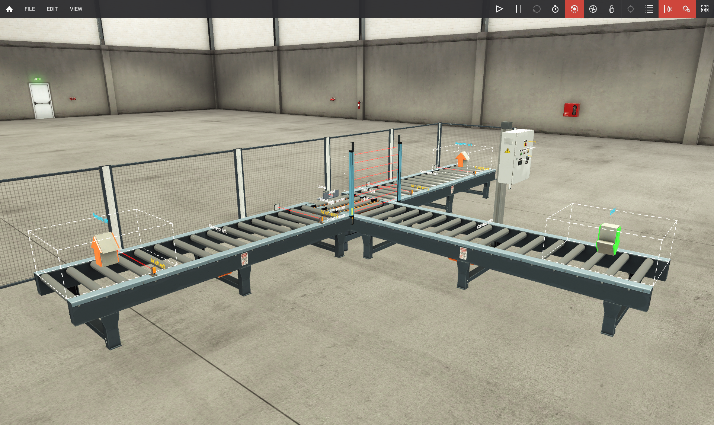
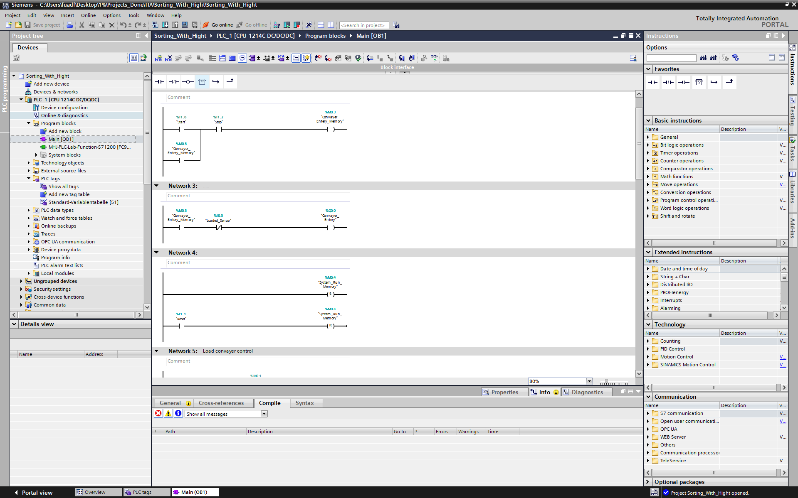
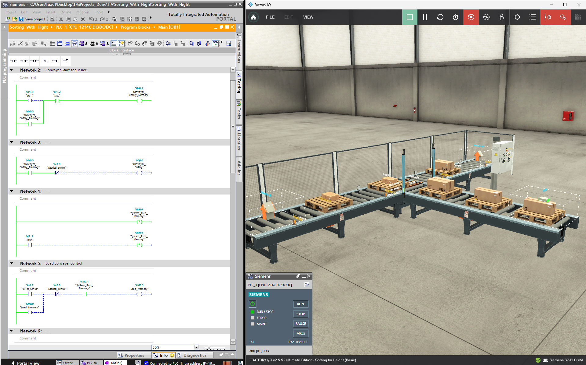

# Factory I/O Height Sorting System using Siemens PLC

## Project Overview

This project is an automatic conveyor sorting system developed using:

- Siemens TIA Portal
- Factory I/O
- Ladder Logic (LAD)
- Siemens S7-1200 PLC

The system detects package height and automatically routes packages to different conveyor paths.

---

# Features

- Automatic conveyor operation
- Height-based package sorting
- High and low object detection
- Conveyor zone control
- Transfer mechanism control
- Emergency stop system
- Memory-based sequencing
- Conveyor interlocking

---

# System Layout

The system consists of:

- Entry conveyor
- Chain transfer section
- Left conveyor path
- Right conveyor path
- Retroreflective sensors
- Height sensors
- Transfer pushers

---

# Working Principle

1. Entry conveyor feeds package into transfer zone
2. Height sensors classify object:
   - Small object
   - Tall object
3. PLC stores sorting decision using memory bits
4. Correct transfer mechanism activates
5. Package is routed to:
   - Left conveyor
   - Right conveyor
6. System resets and waits for next package

---

# PLC Tags Used

## Digital Inputs

| Tag | Address | Description |
|---|---|---|
| High_Sensor | %I0.0 | Detects tall packages |
| Low_sensor | %I0.1 | Detects small packages |
| Pallet_Sensor | %I0.2 | Detects pallet presence |
| Loaded_Sensor | %I0.3 | Detects package in transfer zone |
| Right_Entry_Sensor | %I0.4 | Detects package entering right conveyor |
| Left_Entry_Sensor | %I0.5 | Detects package entering left conveyor |
| Right_Exit_Sensor | %I0.6 | Detects package leaving right conveyor |
| Left_Exit_Sensor | %I0.7 | Detects package leaving left conveyor |
| Start | %I1.0 | Starts system operation |
| Reset | %I1.1 | Resets system states |
| Stop | %I1.2 | Stops system operation |

---

## Digital Outputs

| Tag | Address | Description |
|---|---|---|
| Convayer_Entery | %Q0.0 | Main entry conveyor |
| Load | %Q0.1 | Load conveyor / chain transfer |
| Transfer_Right | %Q0.2 | Transfers package to right side |
| Transfer_Left | %Q0.3 | Transfers package to left side |
| Convayer_Right | %Q0.4 | Right conveyor path |
| Convayer_Left | %Q0.5 | Left conveyor path |

---

## Internal Memory Bits

| Tag | Address | Description |
|---|---|---|
| Load_Memory | %M0.0 | Stores load sequence state |
| High_Sensor_Memory | %M0.1 | Stores tall package detection |
| Low_Sensor_Memory | %M0.2 | Stores small package detection |
| Convayer_Entery_Memory | %M0.3 | Stores entry conveyor latch |
| System_Run_Memory | %M0.4 | Master system run memory |

---

# Important PLC Concepts Used

- Seal-in logic
- SR latching
- Conveyor interlocking
- Priority logic
- Sensor sequencing
- TON timers
- Memory bits
- Zone occupancy logic

---

# Screenshots

## Factory I/O Scene

---

## Ladder Logic

---

## Online Monitoring

---

# Demo Video

[Download Demo Video](videos/demo.mp4)

---

# Software Used

- Siemens TIA Portal
- Siemens PLCSIM
- Factory I/O

---

# Skills Demonstrated

- PLC Programming
- Industrial Automation
- Conveyor Control
- Factory I/O Simulation
- Ladder Logic Design
- Industrial Sequencing
- Automation Troubleshooting

---

# Future Improvements

- Add object counters
- Add alarm system
- Add SCADA monitoring
- Add HMI controls
- Add jam detection